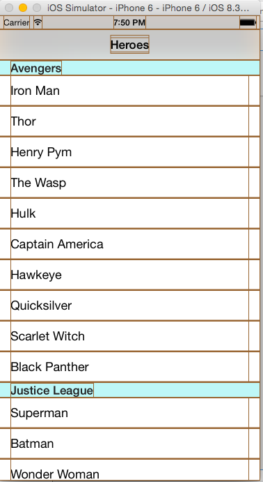

# Border
Make border for all views

[](https://travis-ci.org/onmyway133/Border)
[](http://cocoadocs.org/docsets/Border)
[](https://github.com/Carthage/Carthage)
[](http://cocoadocs.org/docsets/Border)
[](http://cocoadocs.org/docsets/Border)


## Usage

- Just import the framework
- [Show layout bounds in iOS](http://www.fantageek.com/blog/2015/11/04/show-layout-bounds-in-ios/)
- The original Objective C implementation uses `__attribute__((constructor))`, this Swift version uses `initialize` on `UIView extension`



## Installation

**Border** is available through [CocoaPods](http://cocoapods.org). To install
it, simply add the following line to your Podfile:

```ruby
pod 'Border'
```

**Border** is also available through [Carthage](https://github.com/Carthage/Carthage).
To install just write into your Cartfile:

```ruby
github "onmyway133/Border"
```

## Author

Khoa Pham, onmyway133@gmail.com

## Contributing

We would love you to contribute to **Border**, check the [CONTRIBUTING](https://github.com/onmyway133/Border/blob/master/CONTRIBUTING.md) file for more info.

## License

**Border** is available under the MIT license. See the [LICENSE](https://github.com/onmyway133/Border/blob/master/LICENSE.md) file for more info.
